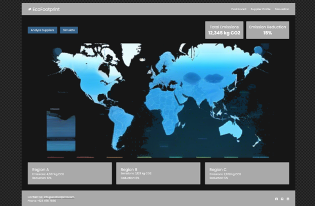
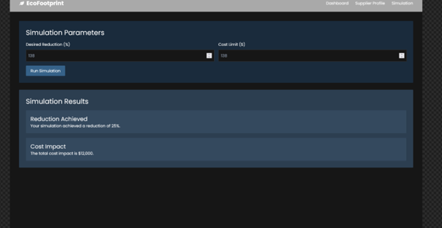
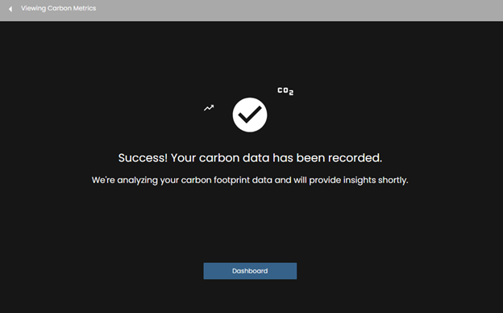
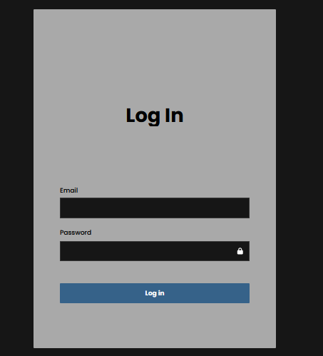

Frank Vocatura

CFO Heuristic Eval

1. Visibility of System Status
    1. I will have error catching and status checks within this application to always notify the user if an API/Model is not responding. There will be error pages and catching.
2. Match between system and the real world
    1. There will be familiar UI/UX elements used in this project. The map will be tested and have a great feeling when using it.
3. User control and freedom
    1. There are ‘back buttons’ at pivotal points and there will be validation on all forms that checks before submissions so errors will be caught and the user will be notified.
4. Consistency and standard
    1. There is a standardized style in this application.

5. Error prevention
    1. There are error pages and form validation at every point necessary in the application.
6. Recognition rather than recall
    1. The elements will be easy to recognize and what they will be used for.

7. Flexibility and efficiency of use
    1. Any user will be able to navigate the application.
8. An aesthetic and minimalist design
    1. This design is minimalistic and easy to navigate. It will not be cluttered.
9. Help users recognize, diagnose, and recover from errors
    1. There will be error messages and status codes from requests.
10. Help and documentation
    1. There will be a FAQ present in the final application.